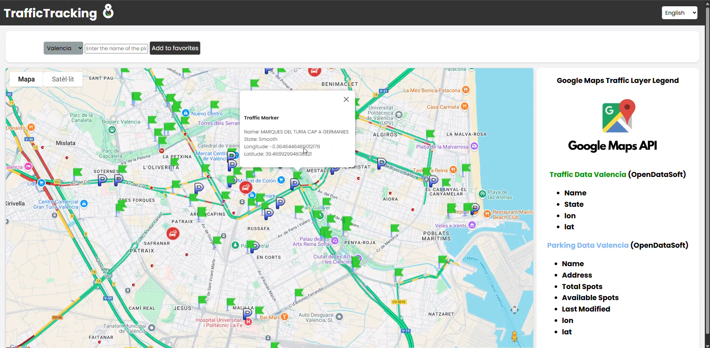
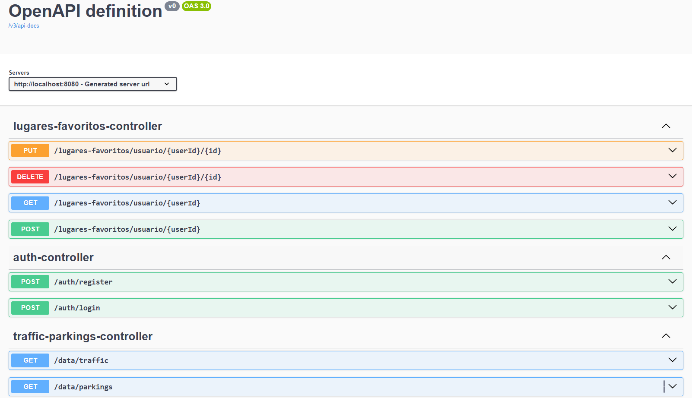

# 🚦 TrafficTracking
Sistema de seguimiento de tráfico en tiempo real desarrollado con Spring Boot.
---

## 📌 Descripción

**TrafficTracking** es una aplicación backend desarrollada en **Java con Spring Boot**, que ofrece una API REST para gestionar información sobre tráfico, ubicaciones favoritas del usuario y parkings disponibles.

El proyecto simula una solución real para consultar tráfico en tiempo real y almacenar lugares importantes para el usuario.

---

## 🚀 Tecnologías utilizadas

- Java 17
- Spring Boot
- Spring Data JPA
- MySQL
- Maven
- Control de errores y DTOs
- Estructura por capas (Controller – Service – Repository – Model)

---

## ⚙️ Funcionalidades

- 🔍 Consultar tráfico por zonas
- 📍 Guardar y listar ubicaciones favoritas
- 🅿️ Ver disponibilidad de parkings
- ✅ API REST estructurada y documentada
- 🛡️ Validaciones básicas y manejo de errores

---
## Video explicativo

Puedes ver el video aquí:

[Ver video en Google Drive](https://drive.google.com/file/d/13LZVlQxOOJ4uM0--UX7TUCGI1rXsAQDy/view?usp=sharing)

---
## Endpoints y documentacion de la api RESTcon openAPI y swagger

---
